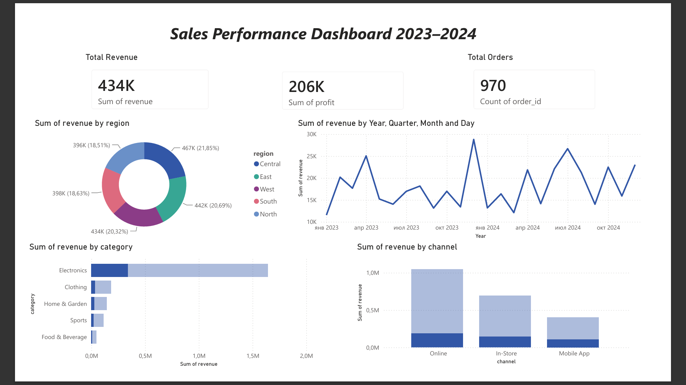

# Sales Performance Dashboard

Interactive sales analytics dashboard built with Python, SQL, Power BI, and Streamlit.

## Live Demo
🔗 [Open Dashboard](https://sales-dashboard-8unsqx6dewrjtb3xfred6m.streamlit.app/)

## Preview


## Tech Stack
- **Python** — data generation (pandas, numpy)
- **SQL** — analytical queries (SQLite)
- **Power BI** — business intelligence dashboard
- **Streamlit + Plotly** — interactive web dashboard

## Key Insights
- **$2.1M** total revenue across 5,000 orders (2023–2024)
- **47.6%** average profit margin
- **Electronics** is the top category by revenue (~70% of total)
- **Online** channel drives the most sales (50%)

## Project Structure
```
sales-dashboard/
├── data/
│   └── generate_data.py    # generates 5000 synthetic orders
├── sql/
│   ├── schema.sql          # table schema
│   └── queries.sql         # 7 analytical queries
├── app/
│   └── dashboard.py        # Streamlit dashboard
├── screenshots/
│   └── dashboard.png
└── requirements.txt
```

## Run Locally
```bash
pip install -r requirements.txt
python data/generate_data.py
streamlit run app/dashboard.py
```
